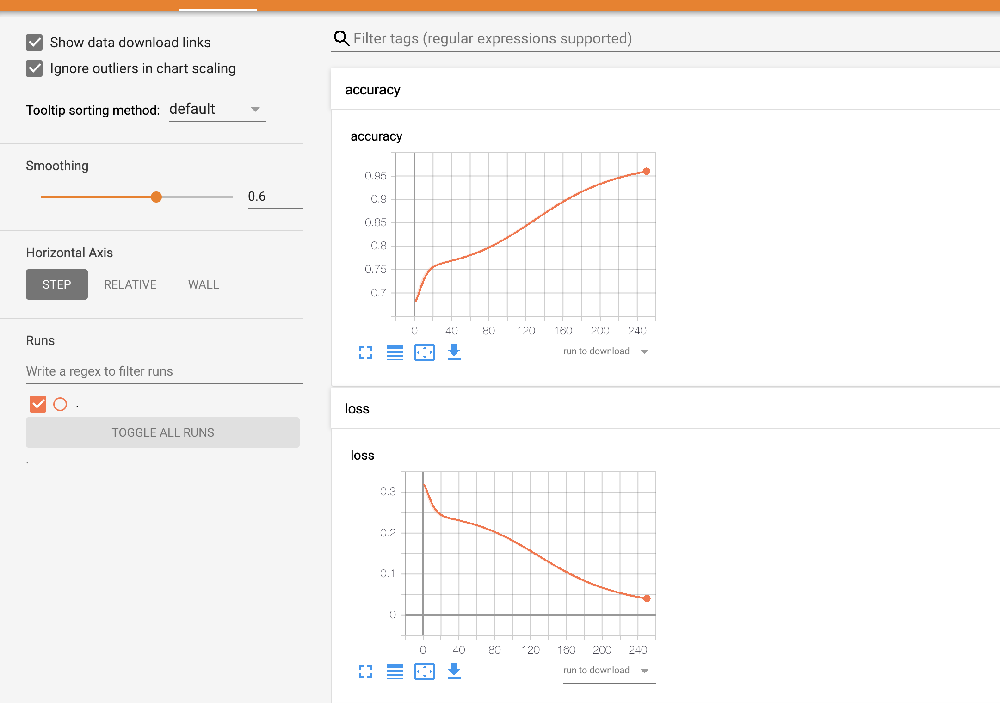
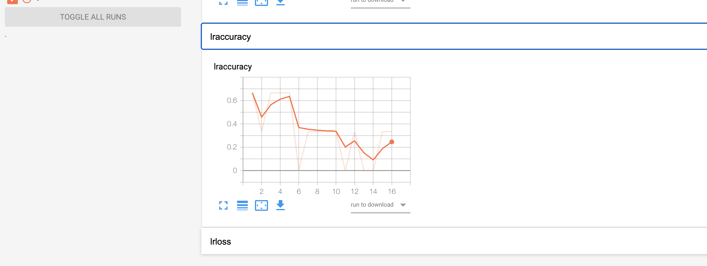

## Logging using callback

Callbacks are methods that are called at various states during the optimization process. You can find more info about callbacks [here](https://github.com/mlpack/ensmallen/blob/master/doc/callbacks.md)

`MlboardLogger` callback allows you to log metrics.These examples help you to understand `mlboard::MlboardLogger` API in depth.

### Logging Loss and accuracy

By default we log the loss and corresponding accuracy in the file. 

The API is 

```cpp
MlboardLogger(mlboard::FileWriter& output,
              int epochCount = 1,
              std::string accTag = "accuracy",
              std::string lossTag = "loss")
```

The arguments are the `FileWriter` object and the `epochCount`, at which intervals of epoch should the metric be logged and the related tag to uniquely identify each of them.

An example could be:

```cpp
#include <mlboard/mlboard.hpp>
#include <iostream>
#include <chrono> 
#include <ctime> 
#include <future>

int main()
{
  // Creating a FileWriter object that is responsible for logging the summary.
  std::chrono::time_point<std::chrono::system_clock> start, end; 
  start = std::chrono::system_clock::now(); 
  mlboard::FileWriter f1("temp");
  arma::mat data;
  arma::mat labels;

  data::Load("./data/lab1.csv", data, true);
  data::Load("./data/lab3.csv", labels, true);

  FFN<MeanSquaredError<>, RandomInitialization> model;

  model.Add<Linear<>>(1, 2);
  model.Add<SigmoidLayer<>>();
  model.Add<Linear<>>(2, 1);
  model.Add<SigmoidLayer<>>();

  std::stringstream stream;
  ens::StandardSGD opt(0.1, 1, 1000);
  // Pass a callback.
  model.Train(data, labels, opt, ens::MlboardLogger(f1));
  
  end = std::chrono::system_clock::now(); 
  std::chrono::duration<double> elapsed_seconds = end - start; 
  std::time_t end_time = std::chrono::system_clock::to_time_t(end); 

  std::cout << "finished computation at " << std::ctime(&end_time) 
            << "elapsed time: " << elapsed_seconds.count() << "s\n"; 
}
```

The output would be similar to:

<p>

</p>

### Logging Custom scaler metric

You could also build a custom function that logs some other metric and pass it to the callback.

The API is:
```cpp
MlboardLogger(
    mlboard::FileWriter& output,
    std::function<double()> func,
    int epochCount = 1,
    std::string accTag = "accuracy",
    std::string lossTag = "loss")
```

The arguments are similar to previous API, it takes a function as an additional parameter. The function should `return a double value`. We log that value as `loss` and it should be between 0 and 1. We log `1 - return value` as `accuracy`.

An example could be:

```cpp
#include <mlboard/mlboard.hpp>
#include <iostream>
#include <chrono> 
#include <ctime> 
#include <future>

int main()
{
  // Creating a FileWriter object that is responsible for logging the summary.
  std::chrono::time_point<std::chrono::system_clock> start, end; 
  start = std::chrono::system_clock::now(); 
  mlboard::FileWriter f1("temp");
  arma::mat data = "1 2 3;"
                   "1 2 3;";
  arma::Row<size_t> responses("1 1 0");

  ens::StandardSGD sgd(0.1, 1, 50);
  LogisticRegression<> logisticRegression(data, responses, sgd, 0.001);
  std::stringstream stream;

  // Create a callback, where we use mlpack ComputeAccuracy function to 
  // log accuracy
  ens::MlboardLogger cb(*f1, 
        [&]()
      {
        return logisticRegression.ComputeAccuracy(data, responses)/100;
      }, 1,
      "lraccuracy","lrloss"
  );
  // Now train a logistic regression object on it.
  logisticRegression.Train<ens::StandardSGD>(data, responses, sgd,
                                             cb);

  
  end = std::chrono::system_clock::now(); 
  std::chrono::duration<double> elapsed_seconds = end - start; 
  std::time_t end_time = std::chrono::system_clock::to_time_t(end); 

  std::cout << "finished computation at " << std::ctime(&end_time) 
            << "elapsed time: " << elapsed_seconds.count() << "s\n"; 
}
```

In this example we create a custom function which logs accuracy based on the ComputeAccuracy method. The function return a value and that is logged as loss and `1 - return value` is logged as `accuracy`.

The output would be similar to:

<p>

</p>
