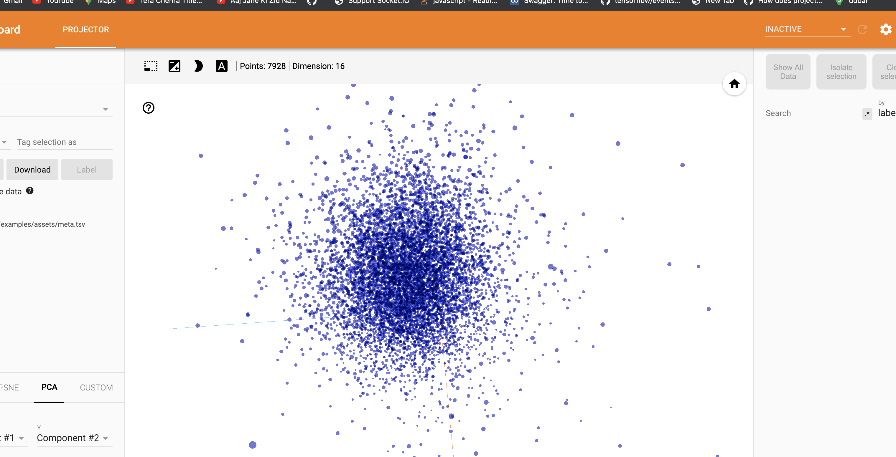

## Logging Embedding

These examples help you to understand `SummaryWriter::Embedding()` API in depth.

### 0. API 

  1. [Log Embedding](#1-embedding)
  2. [Log embedding stored in arma::mat](#2-embedding-arma-mat)

### 1. Embedding

An embedding could be logged using the following API:

```cpp
void Embedding(const std::string &tensorName,
               const std::string &tensordataPath,
               mlboard::Filewriter& fw,
               const std::string &metadataPath,
               const std::vector<size_t> &tensorShape);
```

The API accepts `tensorName`, `tensordataPath`, `mlboard::Filewriter` object and option values such as `metadataPath` and `tensorShape`.

Following is a snippet that would log some embedding values.

```cpp
#include <mlboard/mlboard.hpp>
#include <iostream>
#include <chrono> 
#include <ctime> 
#include <future>
int main()
{
  // Creating a FileWriter object that is responsible for logging the summary.
  std::chrono::time_point<std::chrono::system_clock> start, end; 
  start = std::chrono::system_clock::now(); 
  mlboard::FileWriter f1("temp");
  // Log embedding.
  // Make sure the path are relative to the log directory.
  mlboard::SummaryWriter<mlboard::FileWriter>::Embedding("vocab",
       "../examples/assets/vecs.tsv",f1,"../examples/assets/meta.tsv");
  
  // This will allow you to indicate that you have logged all your data.
  f1.Close();
  end = std::chrono::system_clock::now(); 
  std::chrono::duration<double> elapsed_seconds = end - start; 
  std::time_t end_time = std::chrono::system_clock::to_time_t(end); 
  std::cout << "finished computation at " << std::ctime(&end_time) 
            << "elapsed time: " << elapsed_seconds.count() << "s\n"; 
}
```

The output would be similar to:

<p>

</p>

### 2. Embedding Arma Mat

You could log embedding values stored in `arma::mat` using the following API:

```cpp
void Embedding(const std::string& tensorName,
               const arma::mat& tensorData,
               const std::vector<std::string>& metadata,
               mlboard::Filewriter& fw,
               std::string tensordataPath = "",
               std::string metadataPath = "",
               std::string relativeTensordataPath = "",
               std::string relativeMetadataPath = "");
```

Following is a snippet that would log some embedding values stored in `arma::mat`.

```cpp
#include <mlboard/mlboard.hpp>
#include <iostream>
#include <chrono> 
#include <ctime> 
#include <future>
int main()
{
  // Creating a FileWriter object that is responsible for logging the summary.
  std::chrono::time_point<std::chrono::system_clock> start, end; 
  start = std::chrono::system_clock::now(); 
  mlboard::FileWriter f1("temp");
  // Log embedding.
  arma::mat temp;
  mlpack::data::Load("./examples/assets/vecs.tsv", temp);
  std::cout<<"rows"<<temp.n_rows<<" "<<temp.n_cols<<std::endl;
  std::vector<std::string> meta;
  std::string line;
  ifstream meta_file("./examples/assets/meta.tsv");
  while (getline(meta_file, line))
  {
    meta.push_back(line);
  }
  meta_file.close();

  // Make sure you pass the correct dimensions here.
  // Here we transpose the matrix since our dataset was loaded according to mlpack convention
  // Row is feature and column is data point.
  mlboard::SummaryWriter<mlboard::FileWriter>::Embedding("vocab", temp.t(), meta, f1);
  
  // This will allow you to indicate that you have logged all your data.
  f1.Close();
  end = std::chrono::system_clock::now(); 
  std::chrono::duration<double> elapsed_seconds = end - start; 
  std::time_t end_time = std::chrono::system_clock::to_time_t(end); 
  std::cout << "finished computation at " << std::ctime(&end_time) 
            << "elapsed time: " << elapsed_seconds.count() << "s\n"; 
}
```

Note : Internally we save the matrix to a `.tsv` file along with metadata file and then create a configuration file so that it could be logged. The matrix is written exactly it is given. So if you want to transpose it you need to pass a transposed matrix in case you are using `mlpack::Load()` to load the data. Also if you are giving a path to save the matrix into a file you should give realtive path of the file too so that the config file from log dir can access it.
