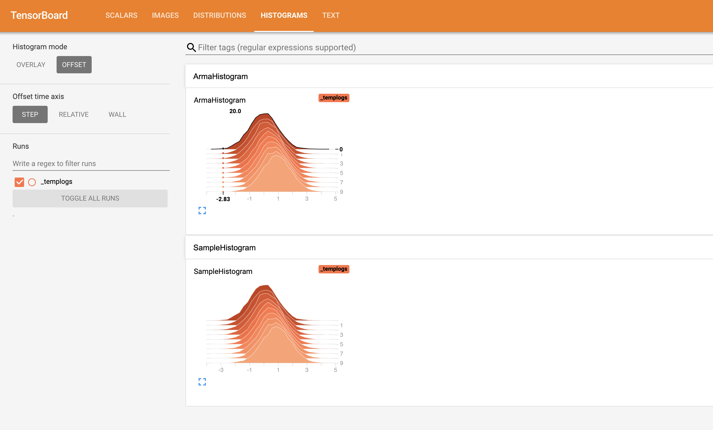

## Logging Histogram

These examples help you to understand `SummaryWriter::Histogram()` API in depth.

### 0. API 

  1. [Log Histogram](#1-histogram)
  2. [Log Histogram stored in arma::vec](#2-histogram-arma-vec)

### 1. Histogram

A histogram could be logged using the following API:

```cpp
void Histogram(const std::string& tag,
               int step,
               std::vector<double>& values,
               Filewriter& fw);
```
The API accepts `tag`, `step`, `values` and `filewriter` object.

Following is a snippet that would log some histogram values.

```cpp
#include <mlboard/mlboard.hpp>
#include <iostream>
#include <chrono> 
#include <ctime> 
#include <future>
#include <random>

int main()
{
  // Creating a FileWriter object that is responsible for logging the summary.
  std::chrono::time_point<std::chrono::system_clock> start, end; 
  start = std::chrono::system_clock::now(); 
  mlboard::FileWriter f1("temp");
  // Log histogram.
  std::default_random_engine generator;
  std::normal_distribution<double> default_distribution(0, 1.0);
  for (int i = 0; i < 10; ++i)
  {
    std::normal_distribution<double> distribution(i * 0.1, 1.0);
    std::vector<double> values;
    for (int j = 0; j < 10000; ++j)
    {
      values.push_back(distribution(generator));
    }
    mlboard::SummaryWriter<mlboard::FileWriter>::Histogram("SampleHistogram",
        i, values, f1);
  }
  // This will allow you to indicate that you have logged all your data.
  f1.Close();
  end = std::chrono::system_clock::now(); 
  std::chrono::duration<double> elapsed_seconds = end - start; 
  std::time_t end_time = std::chrono::system_clock::to_time_t(end); 
  std::cout << "finished computation at " << std::ctime(&end_time) 
            << "elapsed time: " << elapsed_seconds.count() << "s\n"; 
}
```

The output would be similar to:

<p>

</p>

### 2. Histogram Arma vec

You could log histogram values stored in `arma::vec` using the following API:

```cpp
template<typename RowType>
void Histogram(const std::string& tag,
               int step,
               const RowType& values,,
               Filewriter& fw);
```
Following is a snippet that would log histogram values stored in `arma::vec`.

```cpp
#include <mlboard/mlboard.hpp>
#include <iostream>
#include <chrono> 
#include <ctime> 
#include <future>
#include <random>

int main()
{
  // Creating a FileWriter object that is responsible for logging the summary.
  std::chrono::time_point<std::chrono::system_clock> start, end; 
  start = std::chrono::system_clock::now(); 
  mlboard::FileWriter f1("temp");
  // Log histogram.
  std::default_random_engine generator;
  std::normal_distribution<double> default_distribution(0, 1.0);
  for (int i = 0; i < 10; ++i)
  {
    std::normal_distribution<double> distribution(i * 0.1, 1.0);
    std::vector<double> values;
    for (int j = 0; j < 10000; ++j)
      values.push_back(distribution(generator));
    arma::rowvec tempValues(values);
    mlboard::SummaryWriter<mlboard::FileWriter>::Histogram("ArmaHistogram",
        i, tempValues, f1);
  }
  // This will allow you to indicate that you have logged all your data.
  f1.Close();
  end = std::chrono::system_clock::now(); 
  std::chrono::duration<double> elapsed_seconds = end - start; 
  std::time_t end_time = std::chrono::system_clock::to_time_t(end); 
  std::cout << "finished computation at " << std::ctime(&end_time) 
            << "elapsed time: " << elapsed_seconds.count() << "s\n"; 
}
```