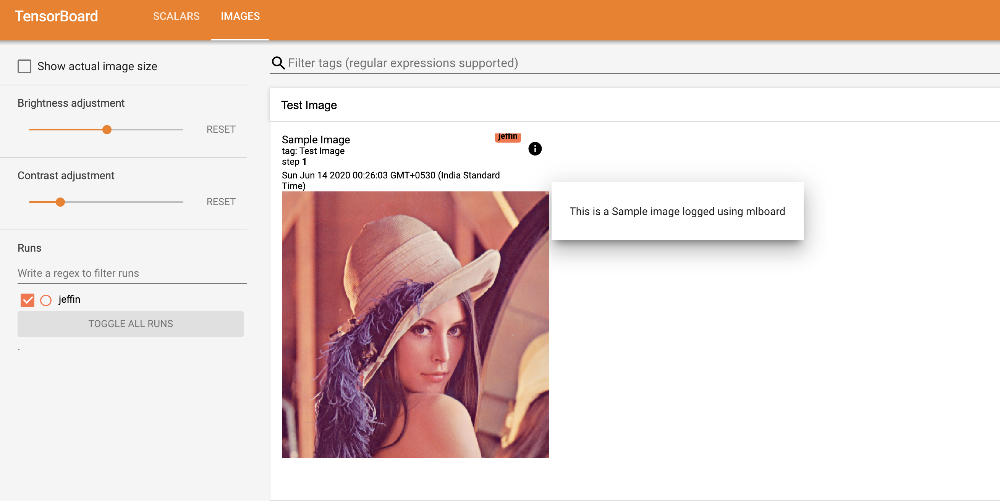
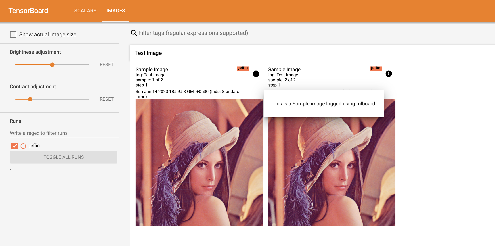

## Logging Image 

These examples help you to understand SummaryWriter::Image API in depth

### 0. API 

  1. [Log a single image](#1-single-image)
  2. [Log multiple image](#2-multiple-image)
  3. [Log multiple image stored in arma::mat](#3-multiple-image-arma-mat)
  4. [Log images stored at a location](#4-multiple-image-stored-at-location)

### 1. Single Image

A single Image could be logged using the following API

```
SummaryWriter<Filewriter>::Image(const std::string& tag,
                                 int step,
                                 const std::string& encodedImage,
                                 int height,
                                 int width,
                                 int channel,
                                 Filewriter& fw,
                                 const std::string& displayName,
                                 const std::string& description)
```

The API accepts `tag`, `step`, `encodedImage` (Image data in encoded format) and then the metadata about image along with filewriter object and Name and description.

Following is a snippet that would log a single image for 1 step in temp directory.

```

#include <mlboard/mlboard.hpp>
#include <iostream>
#include <chrono> 
#include <ctime> 
#include <future>

using namespace std;
using namespace mlboard;

int main()
{
    GOOGLE_PROTOBUF_VERIFY_VERSION;

    std::chrono::time_point<std::chrono::system_clock> start, end; 
    start = std::chrono::system_clock::now(); 
    FileWriter f1("temp");
    
    ifstream fin("test_image.png", ios::binary);
    ostringstream ss;

    ss << fin.rdbuf();
    string image(ss.str());
    fin.close();
    mlboard::SummaryWriter<mlboard::FileWriter>::Image(
         "Test Image", 1, image , 512, 512, 3, f1, "Sample Image",
         "This is a Sample image logged using mlboard ");

    end = std::chrono::system_clock::now(); 
    std::chrono::duration<double> elapsed_seconds = end - start; 
    std::time_t end_time = std::chrono::system_clock::to_time_t(end); 
    
    std::cout << "finished computation at " << std::ctime(&end_time) 
              << "elapsed time: " << elapsed_seconds.count() << "s\n"; 
    std::cout<<"hellow"<<std::endl;

    google::protobuf::ShutdownProtobufLibrary();
}

```

The output would be as follows : 

<p>

</p>

### 2. Multiple Image

To log multiple image at an instance you can use the following api:

```
void SummaryWriter<Filewriter>::Image(const std::string& tag,
                                      int step,
                                      const std::vector<std::string>& encodedImages,
                                      int height,
                                      int width,
                                      Filewriter& fw,
                                      const std::string& displayName,
                                      const std::string& description)
```

The API accepts `tag`, `step`, `encodedImage` (A vector of Image data in encoded format) and then the metadata about image along with filewriter object and Name and description.

Following is a snippet that would log a multiple image for 1 step in temp directory.

```
#include <mlboard/mlboard.hpp>
#include <iostream>
#include <chrono> 
#include <ctime> 
#include <future>

using namespace std;
using namespace mlboard;

int main()
{
    GOOGLE_PROTOBUF_VERIFY_VERSION;

    std::chrono::time_point<std::chrono::system_clock> start, end; 
    start = std::chrono::system_clock::now(); 
    FileWriter f1("temp");
    
    ifstream fin("test_image.png", ios::binary);
    ostringstream ss;
    vector<string>encodedImages;
    ss << fin.rdbuf();
    encodedImages.push_back(ss.str());
    fin.close();
    fin.open("one_more_test.png", ios::binary);
    ss << fin.rdbuf();
    encodedImages.push_back(ss.str());
    ss.str("");
    fin.close();
    mlboard::SummaryWriter<mlboard::FileWriter>::Image(
         "Test Image", 1, encodedImages , 512, 512, f1, "Sample Image",
         "This is a Sample image logged using mlboard ");

    end = std::chrono::system_clock::now(); 
    std::chrono::duration<double> elapsed_seconds = end - start; 
    std::time_t end_time = std::chrono::system_clock::to_time_t(end); 
    
    std::cout << "finished computation at " << std::ctime(&end_time) 
              << "elapsed time: " << elapsed_seconds.count() << "s\n"; 
    std::cout<<"hellow"<<std::endl;

    google::protobuf::ShutdownProtobufLibrary();
}

```

The output would be as follows : 

<p>

</p>

### 3. Multiple Image Arma Mat

Since we would we logging mlpack's metrics there are chances when we would have images stored in `arma::mat` and thus you can use the following api to log images stores in arma::mat:

```
void SummaryWriter<Filewriter>::Image(const std::string& tag,
                int step,
                arma::Mat<eT>& matrix,
                mlpack::data::ImageInfo& info,
                Filewriter& fw,
                const std::string& displayName,
                const std::string& description)
```

The API accepts `tag`, `step`, `encodedImage` (An `arma::mat` which has image data) and then the `mlpack::data::ImageInfo` object along with filewriter object and Name and description.

Following is a snippet that would log a multiple image which is stored in `arma::mat` for 1 step in temp directory.

```
#include <mlboard/mlboard.hpp>
#include <iostream>
#include <chrono> 
#include <ctime> 
#include <future>

using namespace std;
using namespace mlboard;

int main()
{
    GOOGLE_PROTOBUF_VERIFY_VERSION;

    std::chrono::time_point<std::chrono::system_clock> start, end; 
    start = std::chrono::system_clock::now(); 
    FileWriter f1("temp");
    
    // Following line are just there to come up with a arma::mat of images.
    // If you aldeardy have a matrix with images you can avoid the following lines.
    arma::Mat<unsigned char> matrix;
    mlpack::data::ImageInfo info;
    std::vector<std::string> files = {"test_image.png", "one_more_test.png"};

    // Creating the matrix which has image.
    mlpack::data::Load(files, matrix, info, false);

    // Now we can log the matrix.
    mlboard::SummaryWriter<mlboard::FileWriter>::Image(
         "Multiple Image", 1, matrix , info, f1, "Sample Multiple Image",
         "This is a Sample image logged using mlboard ");

    end = std::chrono::system_clock::now();
    std::chrono::duration<double> elapsed_seconds = end - start;
    std::time_t end_time = std::chrono::system_clock::to_time_t(end); 
    
    std::cout << "finished computation at " << std::ctime(&end_time) 
              << "elapsed time: " << elapsed_seconds.count() << "s\n"; 
    std::cout<<"hellow"<<std::endl;

    google::protobuf::ShutdownProtobufLibrary();
}

```

The output would be similar to [Log multiple image](#2-multiple-image)

Note : This api takes quite a time to log the image since it first have to process the image stored in `arma::mat`. The way it process is, it saves the image using `mlpack::data::Load()` api for image and then reads it back in encoded format. It is something similar to what mxnet logging tool does [here](https://github.com/TeamHG-Memex/tensorboard_logger/blob/0ec6f1147b7cea8c4b68d26637781ccd8ec036b9/tensorboard_logger/tensorboard_logger.py#L157). Hence it is recomended to log image summary using a `arma::mat` in a seperate thread to avoid increase in training time.

### 4. Multiple Image stored at location

There are many occasion when a user wants to log images which are there in a current folder and you can use the utility function provided under util namespace along with any of the above api.

The utility allows you to convert an image given its path into Encodedformat which can be logged to a file. The api is:

```
void EncodeImage(vector<std::string>& filePaths,
                 std::vector<std::string>>& encodedImages)
```

The function accepts a vector of string which has filePath of the image to be converted and also accepts an empty vector where all the encoded images could be saved. 

An example using the above utility could be:

```
#include <mlboard/mlboard.hpp>
#include <iostream>
#include <chrono> 
#include <ctime> 
#include <future>

using namespace std;
using namespace mlboard;

int main()
{
    GOOGLE_PROTOBUF_VERIFY_VERSION;

    std::chrono::time_point<std::chrono::system_clock> start, end; 
    start = std::chrono::system_clock::now(); 
    FileWriter f1("temp");
 
    // Using the utitlity function encodeImages stored at current location
    vector<string>encodedImages;   
    mlboard::util::EncodeImage({"test_image.png", "one_more_test.png"},
        encodedImages);

    mlboard::SummaryWriter<mlboard::FileWriter>::Image(
         "Test Image", 1, encodedImages , 512, 512, f1, "Sample Image",
         "This is a Sample image logged using mlboard ");

    end = std::chrono::system_clock::now(); 
    std::chrono::duration<double> elapsed_seconds = end - start; 
    std::time_t end_time = std::chrono::system_clock::to_time_t(end); 
    
    std::cout << "finished computation at " << std::ctime(&end_time) 
              << "elapsed time: " << elapsed_seconds.count() << "s\n"; 
    std::cout<<"hellow"<<std::endl;

    google::protobuf::ShutdownProtobufLibrary();
}

```