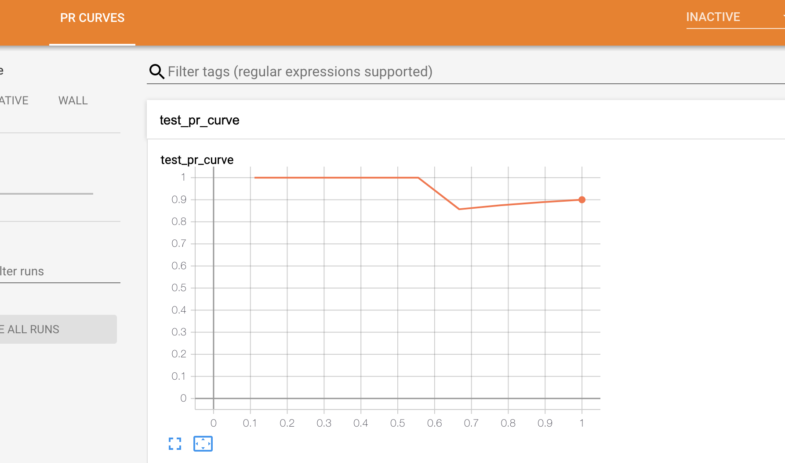

## Logging PR-Curve

These examples help you to understand `SummaryWriter::Prcurve()` API in depth.

### 0. API 

  1. [Log PrCurve](#1-pr-curve)
  2. [Log Prcurve stored in arma::vec](#2-pr-curve-arma-vec)

### 1. PR-Curve

A embedding could be logged using the following API:

```cpp
void PrCurve(const std::string tag,
             const std::vector<double>& labels,
             const std::vector<double>& predictions,
             mlboard::Filewriter& fw,
             int threshold,
             std::vector<double>weights,
             const std::string& displayName,
             const std::string& description)
```

The API accepts `tag`, `labels`, `predictions`, `mlboard::Filewriter`, `thresholds`, `weights`, `displayName` and `description`.

Following is a snippet that would log some embedding values.

```cpp
#include <mlboard/mlboard.hpp>
#include <iostream>
#include <chrono> 
#include <ctime> 
#include <future>
int main()
{
  // Creating a FileWriter object that is responsible for logging the summary.
  std::chrono::time_point<std::chrono::system_clock> start, end; 
  start = std::chrono::system_clock::now(); 
  mlboard::FileWriter f1("temp");
  // Log PR-Curve.
  std::vector<double> labels = {1, 1, 1, 1, 1, 1, 1, 1, 0, 1};
  std::vector<double> predictions = {0.6458941, 0.3843817, 0.4375872,
      0.2975346, 0.891773, 0.05671298, 0.96366274, 0.2726563,
      0.3834415, 0.47766513};
  mlboard::SummaryWriter<mlboard::FileWriter>::PrCurve("test_pr_curve",
      labels, predictions, *f1);
  
  // This will allow you to indicate that you have logged all your data.
  f1.Close();
  end = std::chrono::system_clock::now(); 
  std::chrono::duration<double> elapsed_seconds = end - start; 
  std::time_t end_time = std::chrono::system_clock::to_time_t(end); 
  std::cout << "finished computation at " << std::ctime(&end_time) 
            << "elapsed time: " << elapsed_seconds.count() << "s\n"; 
}
```

The output would be similar to:

<p>

</p>

### 2. PR-Curve Arma vec

You could log prcurve values stored in `arma::vec` using the following API:

```cpp
void PrCurve(const std::string tag,
             const vecType& labels,
             const vecType& predictions,
             mlboard::Filewriter& fw,
             int threshold,
             vecType weights,
             const std::string& displayName,
             const std::string& description)
```

Following is a snippet that would log some prcurve values stored in `arma::vec`.

```cpp
#include <mlboard/mlboard.hpp>
#include <iostream>
#include <chrono> 
#include <ctime> 
#include <future>
int main()
{
  // Creating a FileWriter object that is responsible for logging the summary.
  std::chrono::time_point<std::chrono::system_clock> start, end; 
  start = std::chrono::system_clock::now(); 
  mlboard::FileWriter f1("temp");
  // Log prcurve.
  arma::rowvec labels = {1 ,1, 1, 1, 1 ,1 ,1 ,1 ,0 ,1};
  arma::rowvec predictions = {0.6458941 , 0.3843817, 0.4375872,
      0.2975346, 0.891773, 0.05671298, 0.96366274, 0.2726563,
      0.3834415,0.47766513};
  mlboard::SummaryWriter<mlboard::FileWriter>::PrCurve("test_pr_curve_arma_vec",
      labels, predictions, *f1);

  // This will allow you to indicate that you have logged all your data.
  f1.Close();
  end = std::chrono::system_clock::now(); 
  std::chrono::duration<double> elapsed_seconds = end - start; 
  std::time_t end_time = std::chrono::system_clock::to_time_t(end); 
  std::cout << "finished computation at " << std::ctime(&end_time) 
            << "elapsed time: " << elapsed_seconds.count() << "s\n"; 
}
```