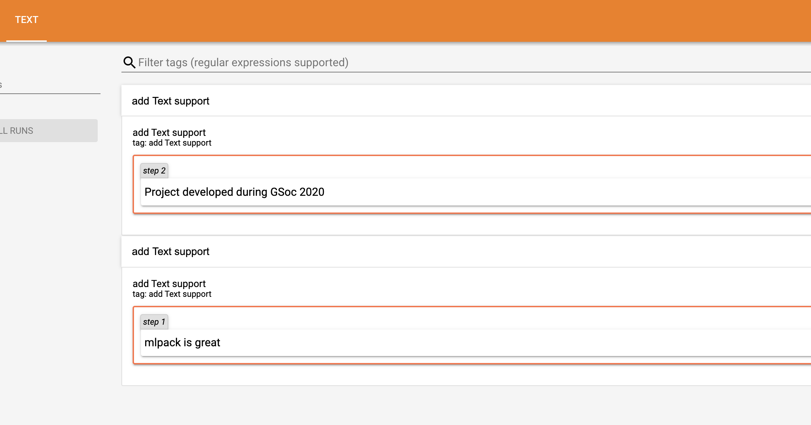

## Logging Text Values

These examples help you to understand `SummaryWriter::Text()` API in depth.

### 0. API 

  1. [Log a Text value](#1-text-value)

### 1. Text Value

A text value could be logged using the following API:

```cpp
template<typename Filewriter>
void SummaryWriter<Filewriter>::Text(const std::string &tag,
                                     int step,
                                     const std::string& text,
                                     mlboard::Filewriter& fw)
```

The API accepts `tag`, `step`, `value` (String value) and `mlboard::Filewriter` object.

Following is a snippet that would log some text values.

```cpp
#include <mlboard/mlboard.hpp>
#include <iostream>
#include <chrono> 
#include <ctime> 
#include <future>

int main()
{
  // Creating a FileWriter object that is responsible for logging the summary.
  std::chrono::time_point<std::chrono::system_clock> start, end; 
  start = std::chrono::system_clock::now(); 
  mlboard::FileWriter f1("temp");
  // Creating a text summary.
  mlboard::SummaryWriter<mlboard::FileWriter>::Text("add Text support ", 1,
      "mlpack is great", f1);
  mlboard::SummaryWriter<mlboard::FileWriter>::Text("add Text support", 2,
      " Project developed during GSoc 2020 ", f1);
  
  // This will allow you to indicate that you have logged all your data.
  f1.Close();
  end = std::chrono::system_clock::now(); 
  std::chrono::duration<double> elapsed_seconds = end - start; 
  std::time_t end_time = std::chrono::system_clock::to_time_t(end); 

  std::cout << "finished computation at " << std::ctime(&end_time) 
            << "elapsed time: " << elapsed_seconds.count() << "s\n"; 
}
```

The output would be similar to:

<p>

</p>
